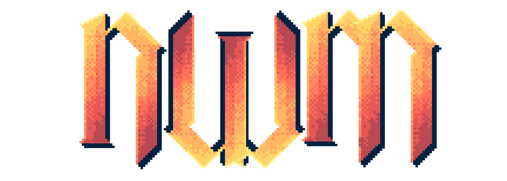
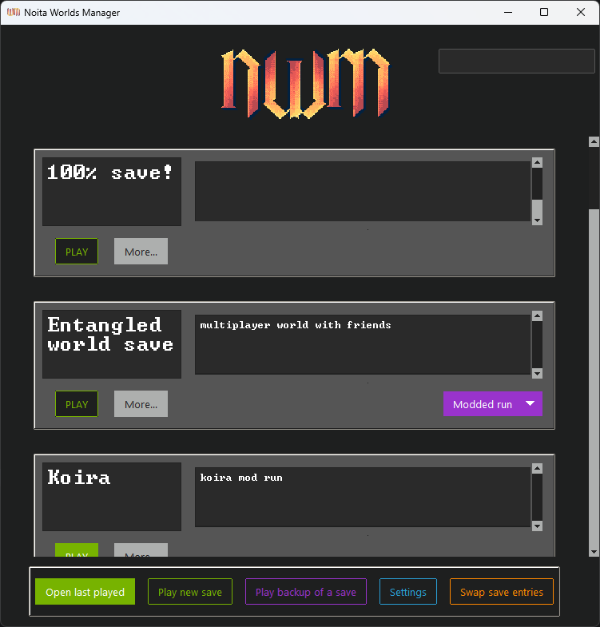
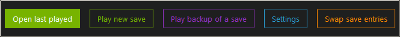
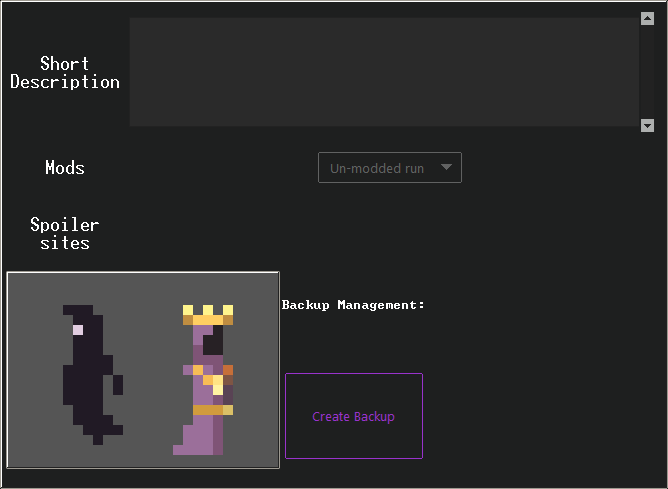
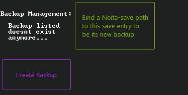
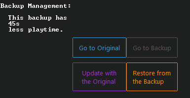
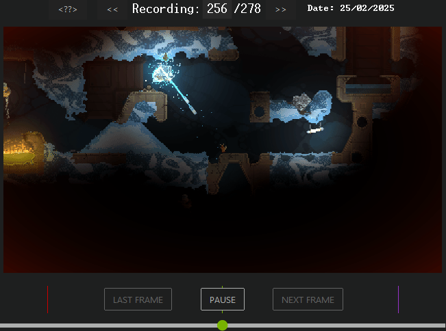
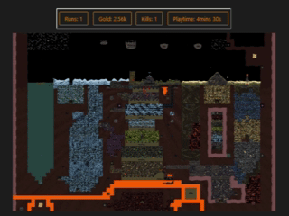

### Table of Contents

* [Homepage](#Homepage)
  * [World-Banners](#World-Banners)
  * [Search bar](#Search-bar)
  * [Footer](#Footer)
* [Save display](#Save-display)
  * [Base display](#Base-display)
  * [Held Wands](#Held-Wands)
  * [GIFs](#GIFs)
  * [Death marker map](#Death-marker-map)
  * [Disabled Save display](#Disabled-Save-display)
    * [XML stats](#XML-stats)
    * [Extra notes](#Extra-notes)
    * [Active Perks](#Active-Perks)
    * [Bone wands](#Bone-wands)
    * [Images](#Images)
  * [Footer](#Footer-2)
* [Settings](#Settings)
  * [Save management](#Save-management)
  * [Appearance](#Appearance)
  * [Stats Frames](#Stats-Frames)
  * [Keybindings](#Keybindings)
  * [Scroll config](#Scroll-config)
  * [Application mod](#Application-mod)
    * [Spoiler links](#Spoiler-links)
    * [XML Stats shown](#XML-Stats-shown)
    * [Mod start args](#Mod-start-args)
    * [Unlisted paths](#Unlisted-paths)
  * [Footer](#Footer-3)
* [Extra large map](#Extra-large-map)

***
# Homepage
The Homepage will show you all the Noita save entries the program has registered.
<br>
## World-Banners
All save entries are shown as individual banners, displaying:
<ul>
<li>The saves name</li>
<li>Its description</li>
<li>Mods (If any are / were enabled)</li>
<li>A "Play" button</li>
<li>A "more" button</li></ul>
The list of mods will show as a dropdown you can click to expand, revealing the names of all the mods that are enabled in the save. Clicking on one of the mod's names in the dropdown will open a page to its Steam workshop site or a Google search if the mod is unique (doesn't originate from Steam).<br>
The Play button allows you to directly play that save. The Play button is either entirely green meaning that save entry has an ongoing run, or the button is only outlined in green, which means there is no ongoing run on that save.<br>
Clicking the more-button will open up a <a href="#Save-display">more detailed view</a> of that save to get a better idea of what save contains. <br>
Normally this More-button is a generic color, however, it will turn orange if that save entry has a corrupt or faulty config (the config contains the name, description and more). You can either write something new in the name or description to re-write the config file, or you open the entry folder and try to manually fix the problematic "data.json" file. You can actively look for faulty save entries by searching for "-faulty", "-error" or"-broken" in the search bar.

## Search bar
On the top-right of the homepage there is a small outlined rectangle. This is the search bar; typing anything in here and pressing enter will hide any save entry that doesn't contain the words searched for.<br>The search function has some keywords that can be used for specific queries:

### Keywords

* **"-modded", "-mods" or "-workshop"**: will display all saves that have any mods enabled.
* **"-vanilla" or "-original"**: will display all unmodded saves.
* **"-active" or "-playing"**: will display all saves that have an ongoing run.
* **"-backups"**: will search for all entries that either are a backup of a save or have a backup.
* **"!"**: will display everything except for the search-term that follows it.
* **"-&"**: will allow you to search for a world with multiple terms.
* **"-list" or "-entries"**: will just give you a count of all entries that are currently being displayed.

Here is an example query: "!-active-&-vanilla". This will display all your saves that have no ongoing run (!-active) and (-&) no mods (-vanilla).<br>
Of course you can search for any string of text too, "XibFelRZkLRuIbA" or "!un0BIenlK" would also be looked for in your entries. But where exactly will the search look through for your term?

The search queries cover:

* [Entry Names](#Base-display)
* [Entry Descriptions](#Description)
* [Extra notes](#Extra-notes)
* [Mod names](#Mods)

Meaning, looking for a save with a specific mod enabled is also possible.<br>
PLEASE NOTE:<br>The search will ignore uppercase and lowercase, new lines, backslashes and spacing.

## Footer
The bottom of the Homepage can consist of up to 5 different buttons; however, the buttons are only shown if the program is able to execute their actions in the first place. "Play new save" and "[Settings](#Settings)" will always be shown.
<br>

* **New save**: When pressing the "Play new save" button, it will ask you under which folder the new Noita save should be placed. You will have to either navigate to that place e.g. folder and create a folder where the program will place this new save.
* **Settings button**: Pressing the "Settings" button opens the [Settings](#Settings) panel.
* **Last played**: If you have ever played a Noita save using this program it will display the "Open last played" button. Pressing this will navigate you to the <a href="#Save-display">Save display</a> of the latest world you played.
* **Play backup**: If you have at least one Noita save entry registered under the program it will show the "Play backup of a save" button. <br>
Pressing this button will allow you to select any world-banners currently being shown on the homepage. The "SELECT" button on the world-banners can have two different colors. 
  * The default color means that the corresponding world-banners' save doesn't have a backup registered for it, selecting such a save will prompt a request to select a folder. <br>Once a location where to save the backup is selected, the program will start copying your save to that location (this can take seconds or minutes depending on the size of the save that has been selected). Once the program is done copying all the files it will automatically open Noita for the backup of the selected save. 
  * If the color of the "SELECT" button is the same color as the "Play backup of a save", it means that there is already a backup registered for that save. Selecting that save entry will automatically play Noita with the backup save of the save in question.

* **Re-organize**: If you have more than 1 world-banner registered, a 5th and final button will appear. "Swap save entries" will allow you to select two different save entries (world-banners) and swap places with each other in order to change their placements on the homepage.
***
# Save display
When opening a save by pressing "More..." on a world-banner or viewing it by other means, it will display the following: The save name will be shown at the top left (can be modified), as well as a selection of subframes that will proceed to load in. These subframes show various information about the save. All of these extra panels can be toggled or rearranged under the [Stats Frames](#Stats-Frames) panel in the settings.

## Base display
This is the base display of any Noita save and cannot be disabled or changed by the settings. This frame shows up to five specifics about the save.
<br>
* ### Description
  Here you can provide a short description of the save. The text within this description can be searched for by using the [Search bar](#Search-bar).

* ### Mods
  In case of any mods being enabled on the save, they will be displayed as a dropdown in the base display panel as well. Unlike the mod display dropdown in the homepage this dropdown shows not only the mods' names but also their description. Clicking on the mod name will lead to the mod's Steam-workshop site, and a Google search if the mod is not directly from the Steam-workshop. Clicking on any line of the mod's description will open the folder wherein the mod is located.

* ### External sites
  The spoiler sites have the ability to spoil a lot about Noita, hence, they are disabled by default but can always be toggled in the [Settings](#Stats-Frames). The pages shown are:

  * <a href="https://www.noitool.com/info?">Noitool</a>: If the selected save has an ongoing run you can view many details regarding the current seed.</li>
  * <a href="https://lymm37.github.io/noita-telescope/">Noita Telescope</a>: If the selected save has an ongoing run, this button will open the page that simulates a very detailed Noita map of your seed.</li>
  * <a href="https://noitamap.com/">Noita Map</a>: This button will open the classic Noita map. The page also provides a lot of information about unique places in Noita.</li>
  * <a href="https://noita.wiki.gg/wiki/Steam_and_GOG_Achievements">Achievements</a>: This button links to the Noita wiki showing some of the achievements that can be accomplished.</li>
  * <a href="https://ipeterov.github.io/noita-progress/">Noita Progress</a>: This page reveals all of Noita's perks, spells and enemies, with a wiki-link to all the entries.</li>

  More about the links shown can be configured by the <a href="#Spoiler-links">Application mod</a> panel in the settings.

* ### Player model
  This is a small panel that just shows a little idle animation of your player character and its ghost variant.<br>
  It can be disabled in the [settings](#Stats-Frames).

* ### Backup management
  The bottom right corner of the "Save display" is always reserved to show and manage the backup of the selected save.<br>If the selected save has never had a backup created for it, there will be a button providing the same functionality as the "Play backup" button on the homepage, except it will not automatically play the backup when created. If a backup had been listed, but the path doesn't exist anymore, there will be an additional button allowing you to rebind a Noita save to the selected save as its backup.
  <br><br>
  <br>If there is a backup listed under the save, the following three things will be shown: 
  * some text saying some basic things about the backup concerning the selected save. 
  * The "Go to Backup" button will display the backup save as a "Save display". 
  * The button underneath labeled "Restore from the Backup" will copy the backup save over the current save selected.

  When you are viewing a save that is a backup of another save there will be two different buttons displayed: "Go to Original" and "Update with Original". 
  * "Go to Original" will open the backups original save display.
  * "Update with Original" will make a backup of the original again (by copying the original to the selected save (its backup)). <br>This allows you to "Update" the backup in case a change in the original save occurred that you want to backup again. 

  If a save is a backup and has a backup all four buttons will be displayed as shown below:
  <br>

## Held Wands
The held wands display allows you to view the wands you are holding in an ongoing run. If no wands are shown or there is no run active, this frame will not be displayed.
<br>
<br>The header shows two arrow buttons allowing you to navigate to the previous or next wand in your inventory. The index being displayed can be set manually by typing your own number and pressing enter to navigate directly to the index you typed.
<br>Double-clicking the picture of the wand itself in the panel will open up the <a href="https://tinker-with-wands-online.vercel.app">Wand Simulator</a> website with the stats and spells of the wand. 
<br>Double-clicking the pictures of the wands spells will open their corresponding <a href="https://noita.wiki.gg/">Noita Wiki</a> website.<br>
Finally, the "export" button will generate a picture of the wand selected. By default, wand picture generated will look like:
<br><br>
You can change the "style" and font of the export in the [settings](#Wand-appearance).

## GIFs
The GIF panel allows you to look through all your recorded GIFs from Noita. 
<br><br>
The GIFs are all grabbed from the saves "../Nolla_Games_Noita/save_rec/screenshots_animated" folder.
### Header
The header of the panel shows:
<ul>
<li>A "&lt??>" button: when pressed a random GIF will be shown".</li>
<li>A "<<" button: when pressed it will show the previous GIF to the one being shown.</li>
<li>A ">>" button: when pressed it will show the GIF recorded later than the one being shown.</li>
<li>A Text Panel: allowing you to manually type a number to directly navigate to the desired GIF entry.</li>
<li>A Date: This is the date when the GIF was recorded on.</li></ul>

### Center
The main display of the panel is the GIF. When double-clicked it will open the original file directly.

### Footer
At the bottom of the GIF display there are three vertical lines in different colors and a slider knob below them. Placing the slider knob in the center (green line) it will play the GIF at the original speed. Moving the slider knob towards the left the speed will gradually slow down, at the red line the GIF being shown will be 0 (Frozen). Going left of the red line the GIF playback will reverse. Moving versus the right side the GIF speed will increase, at the purple line the playback speed doubles (anything further to the right will be faster than 2x).<br>
<br>
Alternatively there is a "PAUSE" button, when pressed, it disables the slider speed, and instead enables the two buttons to its side (LAST FRAME and NEXT FRAME). These buttons provide more accuracy by moving one frame forward/backward per click instead of slowing or speeding up the GIF.
<br><br>
## Death marker map
Straight-up the thing from <a href="https://kamiheku.github.io/noited/">Noited</a>, but a little different. This display slowly shows a new dot on a Noita-map representing a run on the save.
<br><br>
<br><br>
Red dots signify a death, blue dots signify a run that ended without a cause of death (usually by starting a new run). Any green dots mean death in a parallel world. You can hover over each dot, and it will show you some basic information about the run.<br>
When opening the "Save display" the map will slowly load in each death in order to visualize your progress over time. While it loads, the top of the display will update four buttons every second. These buttons show:
<ul>
<li>overall amount of sessions played</li>
<li>overall amount of gold picked up</li>
<li>overall amount of kills</li>
<li>overall playtime accumulated with each run</li></ul>
When the map is done rendering (there are no more sessions left to display) the buttons at the top change their color. If you don't want to wait for the slow rendering you can double-click the Noita-map while its rendering, and instead of slowly drawing each session individually it will draw all at once (faster than waiting for all to sessions to be drawn in individually).
<br><br>
You can hover over the top "Overall" buttons to get their complete values. Pressing any of these buttons will show a new yellow circle in the map. These circles indicate the highlights of their respective category. This means by pressing the "Runs" button it will highlight the ongoing run (if there is an ongoing run). Pressing Gold, Kills or Playtime will draw a yellow dot where  you got the most gold collected, most kills committed or longest time played in a single run.<br>
Additionally, if you are willing to download 1/2 GB worth of Noita map you can extend the functionality of the death marker map. After downloading the <a href="#Extra-large-map">Extra large map</a> and following the instructions in the extracted folder within, you may double-click the Noita map, and it will open a website showing a zoomable map (similar to the <a href="https://noitamap.com/?x=3321&y=-235&zoom=1662&map=regular-main-branch">Noita Map</a>). This detailed map allows you to scroll close to each death to better analyze each end of a run. The large map displays by default the yellow dots (significant runs).
<br><br>

## Disabled Save display
The following panels are disabled by default when first opening the program. They can all be turned on in the [Settings](#Settings) under [Stats Frames](#Stats-Frames).
### XML stats
The "Latest stats" button shows you some generic information about an ongoing run or will try to show stats from the last run you played. You can also select your own stats to be shown in this panel by adding a new entry in the [XML Stats shown](#XML-Stats-shown) in the settings.
<br><br>

### Extra notes
A large panel dedicated only for text (just in case the "Description" area wasn't enough).
<br><br>
(Any text written in the extra notes can also be searched for from the [Search bar](#Search-bar))
### Active Perks
This panel shows all perks you have in an ongoing run.
<br><br>
Directly below the title you find more details regarding the perks:
<ul>
<li>Overall perks: shows the number of perks picked up, this includes duplicates of the same perk and not the amount of unique/different perks picked up.</li>
<li>Re-roll price: The reroll-price shows the current price of the perk-re-roll-machine in the temples</li></ul>
Any perk that was picked up more than once will show a little number on the top-left of the perk's image denoting the amount of times it was picked up. Hovering over the perk will show its name and description, by double-clicking the picture a wiki-link to the perk will open.

### Bone wands
In its function, the panel acts nearly identically to the [Held Wands](#Held-Wands) panel.
<br><br>
Instead of showing held wands it shows the wands Noita decided to save at your death to be respawned in future runs.
Two small differences to the Held wands panel are: 
<ul>
<li>The header from the held wands panel, is an extra "&lt??>" button, that when pressed will display a random bone wand".</li>
<li>The header shows when the file for the bone wand was last modified (In this case it would usually mean when it was created, as copying the save file would invalidate the "creation date" of the file).</li></ul>

### Images
Like the [GIFs](#GIFs) panel, this panel also allows you to view images you took in Noita.
<br><br>
These images are saved under .../Nolla_Games_Noita/save_rec/screenshots

## Footer
The footer of the average "Base display" of saves will look like so:
<br><br>
<ul>
<li>Play save: either a full color button or just outlined, depending on if the selected save has an ongoing run or not. Pressing this button will open Noita for the selected save.</li>
<li>Open folder location: will open the selected save's folder location on your machine.</li>
<li>RETURN: returns you to the previous panel you were on.</li></ul><br>
Depending on certain factors two further buttons may show in the footer:

<br>
The "Death marker Map" button only shows if the [Death marker map](#Death-marker-map) panel has been disabled, yet the [Extra large map](#Extra-large-map) assets exist. Only then the button can be used to generate and show a large death map in your browser.<br>
The other button present in the footer image shown above can appear as two different buttons depending on the save's state:<br>
"Delist from Home" means you are able to delist the save entry from the "homepage" so it may not be displayed there. 
Any save can always be listed to the homepage, if it is not already listed there. Any entry also can be delisted from the homepage if it's reachable through a backup that is visible on the homepage.
<br><br>
The listing and delisting buttons only show if you make a backup of a save. That backup entry isn't automatically listed on the homepage. 
***

# Settings
Settings allow you to set things.

## Save management
In the save management tab you can alter certain aspects regarding saves.
<br><br>

* **Default save path:**
<br>The top-left button allows you to select a folder the program will use as a default directory for:
  * creating new saves
  * creating new backups
  * the program asking you to select a folder

  <br>The checkmark "Load new entries in automatically" will allow the program to scan the default save path provided for any new Noita save folder and automatically add them to the homepage.


* **Backup mode:**<br>
The checkmark will tell the program to either copy everything from a save when making a backup of it, or, if disabled, to only make a copy of the "save00" folder (the important stuff) and the config.xml (your Noita settings).


* **New entries:**<br>
If you have a Noita save that you want to add to the program you can click the "Add a new Noita save" button, and the program will ask you to select a folder (your Noita save folder). 
<br>The checkmark next to it will either add your new save to the top of the homepage (if enabled) or to the bottom of the list of entries in your homepage (disabled by default).


* **Remove an entry:**<br>
The button "Remove a Noita save" will allow you to select any of the "world-banners" listed on the Homepage and unlist them from the page. By default, the unlisted paths are added to a separate list that will be shown under the "Unlisted paths" panel in settings (In case you want to bring it back). 
  <br> By switching on the option next to the remove Noita save button you will skip the  <a href="#Unlisted-paths">unlisting</a> process and remove the path saved entirely (This means the save folder still exists on your machine. Deleting it if unwanted is something you'd have to do manually).

  NOTE: If you delist a save entry permanently, but the folder is in your default saves folder, and you have "Load new entries in automatically" enabled, the program will add your save back to your homepage (you may either: keep the save as unlisted, move the save folder out of your default saves folder, or disable or change the default save settings).


* **Config path:**<br>
The bottom options of the Save management panel are responsible for managing your Noita config for new saves you make. By default, the program will copy a default config.xml into every new save you make. This will cause any new Noita save you create to automatically have all your settings copied over (keybinds, graphics...). If you want to change the current config file, you can press the button in the bottom-right corner of the Save management panel. <br>If you don't want to automatically have your Noita settings copied over to any new saves you start you can prevent the program from copying the config by disabling the feature (bottom-left toggle).


## Appearance
The appearance panel will allow you to alter the way the program presents itself.
<br><br>

* ### Themes
  Pressing the "Select Window Theme" will give you a dropdown option of different theme names. Clicking any of these names will attempt to apply the theme to your window. <br>
  Among the option of selectable themes there is one named "custom" (always present). Applying this theme will prompt message telling you how to proceed in making your very own theme. The custom theme itself is intended for debugging colors, allowing you to better visualize how the attributes in the themes config file affect the program's colors.

* ### Wand appearance
  The next two check buttons affect how the [Wand displays](#Held-wands) exports pictures of wands. By default, the pictures made look as such:
  <br><br>
  The font can be changed to a basic one instead of the Noita font, as the Noita font may be illegible for some. Also, the alternative to a "one to one" export of the wand can be switched to a basic one instead. How the basic wand export + a basic font look like is shown below:
  <br><br>

* ### Recently played
  If "Move recently played saves up to the top" is enabled, the world-banners of the latest save you played in Noita will be moved to the top of your homepage.

* ### Notifications
  This program has a few notifications for various actions performed. Either to notify you or to ask you for confirmation to proceed with an action - for example, when clicking on anything that would open an external link or overwriting a save with its backup. Some of these notifications are truly redundant and rather intended for debugging. If you'd like the program to execute an action without needing extra confirmation all the time, you may increase the threshold to block less important information. 

## Stats Frames
This settings panel allows you to enable or disable and rearrange all panels under the [Save display](#Save-display) (except for the "Base display", shown in the image bellow as "Default").
<br><br>
The Checkmarks to the left of each frame's name is a toggle to either show or hide that frame from the Save display.<br>
You may change the position of the frames by clicking the name of one and then the name of the other:
<br><br>
Enabling and rendering all frames might be somewhat time-consuming when you want to open a "Save display". 
To have better control of how fast the frames will be loaded in, you will find a "Force-render" slider at the bottom. With this slider you can determine how many of the first frames will be rendered before opening a "Save display". Any more frames enabled will be computed and shown after the "Save display" screen is shown.

## Keybindings
The program allows to perform a few actions via a key on your mouse or keyboard. These actions can be bound to any single key (except for mouse button one - you should better not bind anything to that. You need that for clicking).
<br><br>
<ul>
<li>Back: pressing the key that the action "Back" is bound to, will redirect you to the previous frame you were on.</li>
<li>Home: this action will bring you back to the homepage.</li>
<li>Next: the "next" action will move you to the frame you just backed up from.</li>
<li>Open: automatically performs the action of the blue-outlined button in the footer currently being shown.</li>
<li>Play: automatically performs the action of the first button shown in the footer currently being shown</li>
</ul>
You can left-click the blue box in which the current key is being shown and then pressing the desired key you want to bind it to, instead. If the key you pressed is already defined for another action, the keybind request will be ignored.

## Scroll config
Change certain attributes of how you scroll in the program.
<br><br>
* **Inverted scrolling:**
<br>inverts the direction your scroll wheel scrolls the panels. 
* **Scroll intensity:** 
<br>a slider that allows you to define how fast your scroll wheel scrolls.<br>

"sub-frame-scrolling" and "Scroll the frame when x% visible" define how scrollable subpanels should be scrolled. <br>Auto-scrolling example shown below:

<br>
By default, sub-frame-scrolling is enabled, meaning if your mouse hovers over a panel in the main page you are viewing, it will scroll that panel automatically if possible. The frame visibility percentage allows you to determine when this automatic scrolling will take effect. The panels will start being auto-scrollable only if the content of the panel is 100% visible by default. If you set 50% visibility the auto-scrolling of these sub-panels will be possible if at least 50% of the panel show on your screen.<br>
<br>
If "sub-frame-scrolling" is disabled you will have to manually move the sub-panel's scrollbar with your mouse.


## Application mod
In addition to the general settings shown above, there are some slightly more "advanced" modifications / additions that you can make to the program.

### Spoiler links
In addition to the default links the program provides [External sites](#External-sites), you can add any link you want to the list yourself.
<br><br>
Each entry shown in the picture above represents a link that will be displayed in the "External sites" section of the "Base display".<br>
The "VIEW" button shows you the link's name and the link itself. "Enabled" / "Disabled" will show / hide the link from the "External sites" but not remove them from the entry list entirely, that's what the "Remove spoiler link" button is for.<br>
Pressing the top button "Add a link" will open the following display:
<br><br>
The "Setup new link" panel provides an entry for a name helping you to identify the button that opens the link in question. At the very bottom you can also select a color for the button to display the link's name.<br>
There is more to the links... The initial links the program provides can open seed-specific websites. This is achieved by placeholders within the link. They are filled with the data grabbed by the [XML Stats shown](#XML-Stats-shown) panel.<br>
For example: the link opening up the <a href="https://www.noitool.com/info?">Noitool</a> website with your seed looks like this:
```https://www.noitool.com/info?seed={{stats_Seed}}```.
The placeholder "{{stats_Seed}}" will be replaced automatically with the "stats_Seed" argument found in the XML Stats panel.<br>
Another example: In order to open the <a href="https://noitamap.com/?x=512&y=5120&zoom=1726&map=regular-main-branch">Noita Map</a> with the exact coordinates of your player, you could set the link text to be the following: 
```https://noitamap.com/?x={{player_POS X}}&y={{player_POS Y}}&zoom=884&map=regular-main-branch```
(placeholders {{player_POS X}} and {{player_POS Y}} also grabbed by the XML Stats by default).<br>
If you are unsure of the exact names of the placeholders you want to use for the links, you can read more about it in the [XML Stats shown](#XML-Stats-shown) section.

### XML Stats shown

This setting panel allows you to alter the [xml stats](#xml-stats) display and offers more functionality for the creation of [links](#Spoiler-links).

<br><br>
Each entry shown above represents an entry that will grab data from any XML file within a given save. <br>

* VIEW: pressing the view button will show a plaintext popup of the XML stat grabber's true name and its "path" down its XML file.<br>
The grabber name shown as plaintext is the exact string of text that must be used as placeholders in [links](#Spoiler-links) (E.g. the "Seed" true name is stats_Seed, therefore, the placeholder within a link must look like: {{stats_Seed}}). 
* Modify: will open a new panel that will allow you to only modify the "path" down the XML file in order to grab any desired value.
* Enabled/ Disabled: will show or hide the XML stat entry from the [xml stats](#xml-stats) panel.<br>
Disabling the XML entries will not prevent links requiring the XML data from being faulty, the data will still be present, but it is not shown in the xml-panel.
* Remove XML grabber arg: Pressing this will fully remove the entire argument from the program, consequently, it won't be searched for in XML files altogether.

At the top of the main "Xml stats shown" panel is a dropdown named "Add stats-grabber for:". By pressing it, all viable XML files will be listed, by further pressing any of the listed XML file names, the following panel will open (The new entry that will be created will only apply to the XML file you chose in the dropdown): 
<br><br>
The initial configuration can be set only once! You will have to name the new XML grabber entry, and the name you give is the one that will be shown by the [xml stats](#xml-stats) panel. Additionally, you can provide text that will be appended to the XML data the entry will grab (E.g. "$", "s" ...).<br>
The following image shows two XML grabber entries, the top one was made by setting its name to "Money spent" and the append text to " \$"
<br><br>
<br>
#### Modify XML arg
The following explains how set the path leading to the desired data within the XML file.
<br><br>
Under this modify panel you can alter the path of keys and values that the program can detect from the XML file.<br>
The "Available paths" dropdown will show all valid keys and values that you can set the path to by going forward. You can always back up from a selected path using the orange "previous path" button.<br>
When the "Available paths" dropdown turns green, it means you have hit a dead end and cannot continue further (This usually means you have reached a value or a list that the program can display); however, even a path that doesn't lead to a conclusive end can be set as the value that can be grabbed by the argument.<br>
If you have a specific variable in mind and cannot find it in the available paths' dropdown, you will have to tinker around with the "xml_stats_grab" in the ```C:/Users/%USERPROFILE%/AppData/Roaming/Noita_saves/data.json``` file directly.<br>
You can abort any changes to the path you have made by pressing the "cancel" button at the bottom-left.

The final result of the new XML grabber entry (the one shown in the GIF above) can be seen in the image below:
<br><br>

### Mod start args

Initially intended only for <a href="https://github.com/IntQuant/noita_entangled_worlds/releases">noita_entangled_worlds</a> and <a href="https://github.com/Noita-Together/noita-together/releases">noita-together</a>, the mod start args panel displays all mods that require an additional application to run alongside Noita.
<br><br>
Each mod arg entry features:
<ul>
<li>Mod name (top-left): The mod argument will only apply to saves that have the specified mod enabled.</li>
<li>Run Noita as well: enabling this means that Noita will be launched as well as the mod application along-side it.<br>Disabling this toggle means that only the mod application provided will launch. (This option is used for <a href="https://github.com/IntQuant/noita_entangled_worlds/releases">noita_entangled_worlds</a> as the Noita instance can be launched from the mod's application itself)</li>
<li>Hide NWM while mod app is running: When enabled, the Noita Worlds Manager window will stay hidden while Noita or the mods EXE is still running.<br>If disabled, the Noita World Manager window will show up as usual (only after Noita is closed).</li>
<li>Set path: This button will ask you for a path leading to what the argument is looking for (the .exe's that the mod needs to be run properly).</li>
<li>Looking for mod app name: this text field shows the name or path to the mod application the "set path" option requires, forcing the "set path" button to only show the exe named in this text field (This can be manually set as well, in case the application you are looking for, cannot be found with the names provided by the program).</li>
<li>Argument Enabled/ Disabled: a button to tell the program whether to enforce the mod start arg or not, while opening a save with the mod enabled.</li>
<li>VIEW: mainly for debugging purposes, the view button will show a popup with plain text, displaying the entry's arguments and its values.</li>
<li>Remove mod arg: if you want to fully remove a mod argument from the program.</li>
</ul>
By default, the program sets mod arguments for <a href="https://github.com/IntQuant/noita_entangled_worlds/releases">noita_entangled_worlds</a> and <a href="https://github.com/Noita-Together/noita-together/releases">noita-together</a>.<br>
Those are the only two mods I know of, requiring an additional application to run with Noita. However, if you use a mod that requires something to run alongside Noita you can add a mod argument to the program yourself. By clicking the dropdown button in the top-middle of the mod arg's panel and selecting the mod you want to add an argument for. This will add an extra mod arg entry at the bottom of the list like the ones shown in the picture above, allowing you to set all the parameters individually required.<br>
NOTE: The mod start args will open any path you provide (.png, .txt ...), however they can only detect running .exe's, which means that unless the application you provide, is an exe, the "Hide NWM while mod app is running" is useless and will by default behave as though it was disabled.

### Unlisted paths
Any path you unlisted via the [Save management](#Save-management) panel will be shown as an individual entry in here. This panel acts as a sort of "trash bin" for your Noita saves, before permanently removing the paths from the program.
<br><br>
If the autoload entries in "Save management" is enabled, it will make sure to not load in entries that you have already unlisted! However, the "Remove entry" button will fully delete the entry path from the program, meaning the autoload function will no longer know if a path in the default saves isn't wanted anymore.<br>
As long as the permanent removal of entries isn't enabled under the "Save management" panel, all entries will show up here.<br>

<ul>
<li>"VIEW" can perform various actions depending on the unlisted paths' circumstances:</li>
<ul>
<li>"VIEW" (Blue): If the view button of an entry is blue, it means you can open the unlisted entry like any normal entry showing the "Save display".</li>
<li>"VIEW" (Orange): If the button is orange, it means you can open a path leading to the entry you unlisted, but the Noita-save itself could not be found.</li>
<li>"VIEW" (red): If the view button is red, the unlisted path doesn't exist anymore and viewing it, the closest existing path that leads up to the unlisted path will open.</li>
</ul>
<li>"Add entry back" will add the entry back into your main world_path saves. Meaning, it can be viewed as a regular "World banner" on your "Homepage".</li>
<li>"Remove entry" will permanently remove the path from the program.</li>
</ul>

## Footer
<br>
<ul>
<li>CREDITS: The credits' panel is designed to show appreciation to the: libraries, external links, assets and more, as some of their assets were used in order get this program to the way it is.<br>
(Please know: This project is not affiliated with or endorsed by anything shown in these credits!)</li>
<li>Open config folder: Opens the following path on your machine. "C:\Users\%USERPROFILE%\AppData\Roaming\Noita_saves"</li>
<li>RESET TO DEFAULT: This button will reset nearly ALL your settings to the way it was when you first opened the program (This does not include all your listed save entries, those will be copied over to the fresh settings that will be created. But still, maybe make a backup beforehand).</li>
<li>RETURN: redirects you to the previous frame you were on.</li>
</ul>

# Extra large map
The extra large map is a zip file of almost 1/2 gb worth of Noita map images... and some scripts. If you want the extended feature for the "Death marker Map" you can download the zip for it <a href="https://drive.google.com/drive/folders/17ZEoLUdrBhiLyCSF-MiLpOwa4K4B0MVK?usp=sharing">here</a> and follow the readme instructions in the extracted folder.
<br><br>
(This Noita-Map feature was made possible using [noita-mapcap](https://github.com/Dadido3/noita-mapcap) and [OpenSeadragon](https://openseadragon.github.io/).)