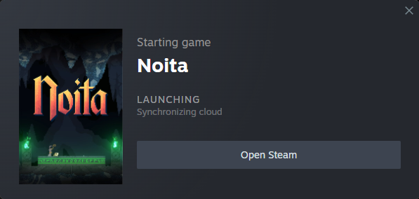

# Noita-Worlds-Manager
Easily play any of your Noita saves!<br><br>
(can show some stuff about your saves too)

## Pre-requisites:
* [Noita](https://noitagame.com/) installed on your machine (25.Jan.2025 Build).
* The program works by using Windows [Junctions](https://learn.microsoft.com/en-us/windows/win32/fileio/hard-links-and-junctions#junctions).
* Make your own separate backup of your original save folder (```C:/Users/%USERPROFILE%/AppData/LocalLow/Nolla_Games_Noita```) and keep it somewhere safe!<br>
  (Always good to have a fallback copy somewhere)

# Opening the program
When first opening the program there is a good chance you may have to configure one or two things:<br>
* **_If the Noita save path_** (```C:/Users/%USERPROFILE%/AppData/LocalLow/Nolla_Games_Noita```) is not a Junction, the program will ask you to move the folder elsewhere, as that is the location the program will create the Junctions at.<br>
You may move your save away manually but moving your original save folder by the program's request, it will automatically allow the program to set the following parameters:
  * "default saves" path: The program by default will look for any valid Noita save folder within it on startup.</li>
  * "default config" path: The config within that world will be used for any future "new save" you create by default. Your Noita keybinds, graphics, etc. will automatically be applied to these new saves.</li>
(All of these behaviors can be changed or disabled in the Settings panel).<br>
* **_If the program fails to automatically find the Noita.exe_** path on your machine, it will ask you to provide the path manually. If you don't have Noita... what are you doing here?
* **_If NWM fails to open a selected save_** make sure that the selected save leads to a folder with a "Nolla_Games_Noita" folder within. There is also a good chance that having the launcher (Steam / GOG) open may fix it. <br>(Manually adjusting "noita_path" and "noita_runner_arg" in "```C:/Users/%USERPROFILE%/AppData/Roaming/Noita_saves/data.json```" could also help)

NOTE: You will always be able to open Noita normally through your launchers at any time (doing so will just open Noita with the last save you selected to play using NWM).
## Warning
When opening Noita through NWM it is important that you wait for cloud syncs to do their thing (best to disable cloud functionalities entirely)!
<br><br>
At the moment shown in the picture above (between Noita being opened and Noita not being open) you could technically open the NWM and press play on any save. NWM will not be able to know, that Noita is opening already and allow you to press any save again. **DO NOT DO THIS!** There is a good chance that it will: at best corrupt one of your save file, or worse, corrupt both save files you pressed play on. <br>
(All in all, give Noita the necessary time to properly close or open between playing saves!)

## Cannot open the exe?
If windows is preventing you from opening the exe directly, you may have to do a little bit of tinkering. To get nwm working on your machine in a different way you can check out the options shown [here](MAKEEXE.md).

# All Done
Congratulations! That all there is to it!<br>
If you want to know everything about the program in order to be able to utilize it best, you can read the [MANUAL.md](MANUAL.md)... otherwise, go play Noita! (If you want)

***

# "Early Access"
I am not satisfied with the program as is yet. I intend to still fix issues that will come up. There are also some more core features I'd definitely like to try and add, especially in case this project gets somewhat "popular" (at least 5 ppl like it). Otherwise, I'll probably just drop it...

* More info display for saves:
  * Display of the tree-achievements unlocked.
  * Display for player inventory.
  * Display for perk progress.
  * Display for spell progress.
  * Display for enemy progress.
* Some quality of life improvements.
* Fix issues with wand display.
* Some performance improvements.
* Crash fixes.
* Bug fixes.
* Make the src code somewhat more readable for other people, too (improve code quality).

Of course your own feature requests and bug reports are welcome too. <br>(I'd be happy to at least try and resolve them.)